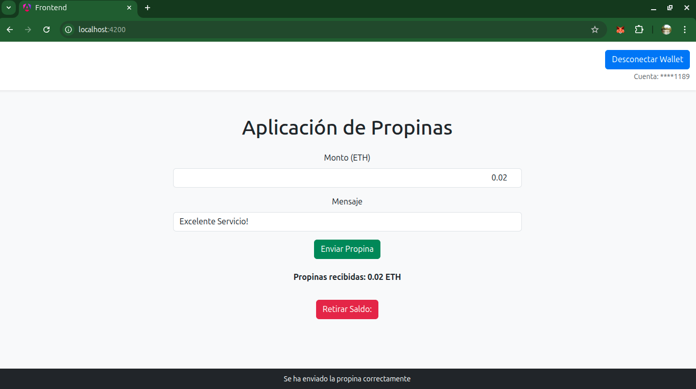

# TipJar DApp 🪙

Una aplicación descentralizada (DApp) que permite a los usuarios enviar propinas en ETH con mensajes personalizados. Construida con Hardhat para el backend blockchain y Angular para el frontend.

## 📋 Descripción

TipJar es un contrato inteligente que funciona como una "jarrita de propinas" digital donde:
- Los usuarios pueden enviar propinas en ETH junto con mensajes personalizados
- El propietario del contrato puede retirar todos los fondos acumulados
- Se mantiene un registro de todas las propinas recibidas
- Los usuarios pueden consultar el historial de propinas y estadísticas

## 🏗️ Estructura del Proyecto

### Smart Contract
- **📄 `contracts/TipJar.sol`** - Contrato principal con todas las funcionalidades de propinas

### Scripts de Deployment e Interacción
- **📁 `scripts/`** - Scripts para desplegar e interactuar con el contrato
- **📁 `ignition/modules/`** - Módulos de Hardhat Ignition para deployment

### Testing
- **📄 `test/TipJar.js`** - Suite completa de tests para el contrato TipJar

### Frontend (Angular)
- **📁 `frontend/`** - Aplicación Angular para interactuar con el contrato
- **📄 `frontend/src/app/services/tip-jar.service.ts`** - Service Angular para interacción con MetaMask y el contrato

## 🔧 Características del Contrato

- ✅ Envío de propinas con mensajes personalizados
- ✅ Retiro de fondos (solo owner)
- ✅ Consulta de balance del contrato
- ✅ Historial de propinas (parcialmente desarrollado)
- ✅ Estadísticas (total de propinas) (parcialmente desarrollado)
- ✅ Transferencia de ownership (parcialmente desarrollado)
- ✅ Eventos para notificaciones en tiempo real (parcialmente desarrollado)

## 🚀 Configuración e Instalación

### Prerrequisitos
- Node.js (v16 o superior)
- npm o yarn
- MetaMask instalado en tu navegador
- ETH de Sepolia testnet

### Instalación del Backend (Hardhat)

```bash
# Clonar el repositorio
git clone https://github.com/negoveron/tip-dapp.git
cd tip-dapp

# Instalar dependencias
npm install

# para manejo de variables de entorno
npm install @nomicfoundation/hardhat-toolbox

```

### Configuración de la Red Sepolia

1. **Obtener ETH de Sepolia testnet:**
   - Visita [Sepolia Faucet](https://sepoliafaucet.com/)
   - Solicita ETH de prueba para tu wallet

2. **Configurar variables de entorno en `vars`:**
   ```env
   npx hardhat vars set ALCHEMY_API_KEY
   your_alchemy_api_key
   npx hardhat vars set SEPOLIA_PRIVATE_KEY
   your_sepolia_api_key
   npx hardhat vars set ETHERSCAN_API_KEY
   your_etherscan_api_key   
   ```

3. **Agregar red Sepolia a MetaMask:**
   - Network Name: Sepolia Testnet
   - RPC URL: https://sepolia.infura.io/v3/YOUR_INFURA_PROJECT_ID
   - Chain ID: 11155111
   - Currency Symbol: ETH
   - Block Explorer: https://sepolia.etherscan.io

## 🛠️ Comandos de Desarrollo

### Compilar el Contrato
```bash
npx hardhat compile
```

### Ejecutar Tests
```bash
# Ejecutar todos los tests
npx hardhat test

# Ejecutar tests con reporte de gas
REPORT_GAS=true npx hardhat test

# Ejecutar tests específicos
npx hardhat test test/TipJar.js
```

### Desplegar el Contrato

#### Deployment local
```bash
# Iniciar nodo local de Hardhat
npx hardhat node

# En otra terminal, desplegar en red local
npx hardhat ignition deploy ./ignition/modules/TipJar.js --network localhost
```

#### Deployment y verificacion en Sepolia
```bash
npx hardhat ignition deploy ./ignition/modules/TipJar.js --network sepolia --verify
```

### Ejecutar Scripts de Interacción
```bash
# Ejemplo de script para interactuar con el contrato
npx hardhat run scripts/interactTipJar.js --network sepolia
```

## 🌐 Configuración del Frontend (Angular)

### Instalación
```bash
cd frontend
npm install
```

### Configuración
1. **Actualizar configuración del contrato:**
   ```typescript
   //ABI del contrato
   cp ../artifacts/contracts/TipJar.sol/TipJar.json src/assets/abis/TipJar.json
      
   // src/environments/environment.ts
   contractAddress: '0x8f7C85B7...',  // Dirección del contrato desplegado   
   
   ```

### Ejecutar la Aplicación
```bash
# Servidor de desarrollo
ng serve

# La aplicación estará disponible en http://localhost:4200
```


## 📝 Uso de la DApp

1. **Conectar MetaMask** - Asegúrate de estar en la red Sepolia
2. **Enviar Propina** - Ingresa un mensaje y la cantidad de ETH
3. **Ver Historial** - Consulta las propinas enviadas y recibidas
4. **Retirar Fondos** - Solo el owner puede retirar los fondos acumulados

## 🧪 Funciones Principales del Contrato

### Para Usuarios
- `tip(string message)` - Enviar propina con mensaje
- `getBalance()` - Ver balance del contrato
- `getTotalTips()` - Ver total de propinas - parcialmente desarrollada
- `getLatestTips(uint256 count)` - Ver últimas propinas  - parcialmente desarrollada

### Para Owner
- `withdraw()` - Retirar todos los fondos
- `transferOwnership(address newOwner)` - Transferir ownership  - parcialmente desarrollada

## 🛠️ Mejoras pendientes

- `loading` - agregar loading durante las esperas de las transacciones del contrato
- `eventos` - controlar eventos como cambio de cuenta y cambio de red

## 🔒 Seguridad

- El contrato utiliza modificadores `onlyOwner` para funciones críticas
- Validaciones de entrada en todas las funciones públicas
- Manejo seguro de transferencias de ETH
- Tests exhaustivos para todos los casos de uso

## 🤝 Contribuir

1. Fork el proyecto
2. Crea una rama para tu feature (`git checkout -b feature/AmazingFeature`)
3. Commit tus cambios (`git commit -m 'Add some AmazingFeature'`)
4. Push a la rama (`git push origin feature/AmazingFeature`)
5. Abre un Pull Request

##  🟢 Vista Previa



## 📄 Licencia

Este proyecto está bajo la Licencia MIT - ver [LICENSE](https://mit-license.org/) para más detalles.

## 👨‍💻 Autor

**Guillermo Verón**

## 🙏 Agradecimientos

- [Hardhat](https://hardhat.org/) - Framework de desarrollo Ethereum
- [Angular](https://angular.io/) - Framework de frontend
- [MetaMask](https://metamask.io/) - Wallet Ethereum
- [Sepolia Testnet](https://sepolia.dev/) - Red de pruebas Ethereum
